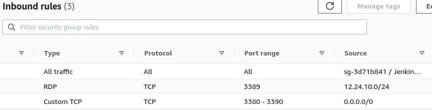
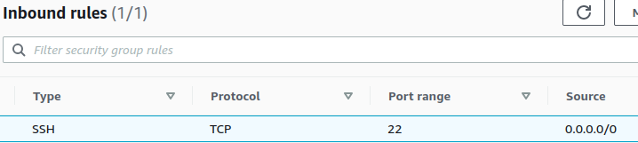

## Amazon Web Services (AWS)

#### Q1. You have an application using a 100 GB MySQL database that you are migrating into AWS. What should you consider when deciding between whether to host the database on RDS for MySQL or Aurora?

- [ ] cost
- [ ] ease of maintenance vs. granularity of control
- [ ] the current storage engine used by the application, such as InnoDB or MyISAM
- [ ] all of these answers

#### Q2. Which database is a NoSQL database type that can quickly store and retrieve key-value pairs?

- [ ] Aurora
- [ ] Neptune
- [ ] DynamoDB
- [ ] RDS for MySQL

#### Q3. Your database is an RDS instance running SQL Server with Multi-AZ replication. You have several older .NET console utilities that perform database operations every 15 seconds. When the cluster has to switch the primary database server to the secondary AZ, the .NET utilities start to report connection failures to the database although other applications are able to access the database. How do you correct this problem?

- [ ] Use the RDS console to force a reboot of the database instance so that the primary server becomes the master server again.
- [ ] The NET utilities need to change the SQL Server endpoint in the connection strings to read from the secondary database server using a try/catch.
- [ ] The server running the .NET utilities is caching the DNS lookup on the database cluster address. Flush the DNS cache of the server and force the C# utilities to open new connections to the database.
- [ ] A.NET application will retain the IP address of a connection string until the host machine is rebooted.

#### Q4. What AWS services can help you automate your development pipeline for continuous integration and continuous deployment?

- [ ] CodePipeline
- [ ] CodeDeploy
- [ ] CodeBuild
- [ ] all of these answers

#### Q5. Which AWS service complies with the standards outlined in Payment Card Industry Data Security Standard (PCI DSS) Level 1 for the handling and transmission of credit card data?

- [ ] API Gateway
- [ ] Simple Queue Service (SQS)
- [ ] Kinesis Data Streams
- [ ] all of these answers

#### Q6. You have a large amount of files on your network-attached storage array that must be archived and maintained for a period of 10 years due to industry regulations. This data will be infrequently accessed but must be kept What is the best AWS service for storing this data?

- [ ] EFS
- [ ] S3 Glacier
- [ ] Snowball
- [ ] OEBS

#### Q7. For your AWS root account, you have generated a random password of the maximum allowed length and included special characters. Which additional steps should you take to secure your AWS root account?

- [ ] Create an AM role for the account administrator with the highest privileges. Do not store the root password, but when the root account is needed reset the password on the root account via email confirmation and repeat this procedure.
- [ ] Store your randomly generated password in your organizational secrets database using a service such as 1Password or LastPass, and only grant access to this secret to the DevOps team.
- [ ] Create IAM accounts for your administrators and attach the AdministratorAccess policy to their accounts. Disable the root account in the user settings.
- [ ] Create an IAM role for the account administrator with the highest privileges and do not use the root account in day-today operations. Enable two-factor authentication on the root account

#### Q8. Which Elastic Load Balancing option supports Lambda as a target?

- [ ] Network Load Balancer
- [ ] Application Load Balancer
- [ ] Lambda can not be called directly by incoming web requests. You must use API Gateway.
- [ ] Classic Load Balancer

#### Q9. How do you architect a solution for an SQL Server database to be replicated across AWS regions in an active-active architecture?

- [ ] Use RDS for SQL Server and create the same instance in two different regions. Use Database Migration Service to keep each database in sync.
- [ ] Use a VPN or VPC peering to establish a connection between the VPCs in each region. Install SQL Server Enterprise Edition on EC2 instances in each region and configure an Always On availability group.
- [ ] Use RDS for SQL Server 2016 or 2017 Enterprise Edition. Enable Multi-AZ support and select the Mirroring/Always On option. Select another region for the mirroring option.
- [ ] You can not set up an active-active architecture for SQL Server that spans geographic regions.

[Reference](https://docs.aws.amazon.com/AmazonRDS/latest/UserGuide/USER_ReadRepl.html?opt_id=oeu1612780272452r0.9199525073583283)

#### Q10. What does it cost to launch an EC2 instance from the AWS Marketplace?

- [ ] All images in the AWS Marketplace incur additional hourly fees in addition to the charges from the instance size you select.
- [ ] Each image has its own pricing that could either be free, or include charges for software licensing costs. You will also pay for the instance the image runs on
- [ ] You can only launch images that were created by other users on your AWS account, so you pay only for the instance size you select and the S3 storage costs for the base image.
- [ ] All images in the AWS Marketplace contain only open-source software with no additional fees and are created by other AWS users. You will pay only for the instance size you select.

#### Q11. When using an ECS cluster with EC2 instances, what maintenance tasks should you perform on the EC2s?

- [ ] The instances created by ECS do not have patches that need to be applied; however, you should make sure your containers contain any important security updates.
- [ ] Refresh the cluster with instances built from the latest ECS AMI.
- [ ] ECS clusters do not use EC2 instances.
- [ ] You should not directly manipulate the EC2 instances created by ECS. AWS will automatically update these instances.

#### Q12. What in-memory caching server is not supported by ElastiCache?

- [ ] Redis 5
- [ ] Memcached
- [ ] Redis 3
- [ ] Elasticsearch

#### Q13. Which AWS service can be used to help generate the documentation required by various compliance standards, such as Payment Card Industry Data Security Standard (PCI DSS) Level 1 for the handling of credit card data?

- [ ] Artifact
- [ ] DocumentDB
- [ ] Print out the AWS Compliance summary and keep it with your required documentation for an audit.
- [ ] Secrets Manager

#### Q14. When using AWS for research and development ahead of a planned migration, how do you prevent unexpected increases or spikes in the billing?

- [ ] Use the billing dashboard to create a cost budget. Input the max amount you want to be charged each month. Any charges that occur over this amount will cause AWS to automatically suspend those resources
- [ ] Using the root AWS account, activate IAM access to the billing information for the account. Make sure your IAM users have the Billing FullAccessGroup policy. Then from the billing dashboard, check the accrued charges once a day.
- [ ] If you are using the AWS free tier, you will have to confirm the usage of any service that goes over the AWS free tier limits.
- [ ] Using the root AWS account enable Billing Alerts in the user preferences. Then use CloudWatch to create a billing alarm and set a threshold to a specific dollar amount for your estimated monthly charges.

#### Q15. You are creating a DynamoDB table to store all movies that have been released since 1938. Your application will allow users to search by movie title and see the details of that film. Given the sample below showing the movie data that you will be importing, what is the best set of keys to apply to this table?

```json
{
  "title": "The Fast and the Furious",
  "year": 2001,
  "cast": ["Vin Diesel", "Paul Walker", "Michelle Rodriguez"],
  "genres": ["Action"]
}
```
- [ ] The primary key should be a partition key of the title field.
- [ ] The primary key should be the title field and the partition key should be the genres field.
- [ ] The primary key should be created as a completely unique value, such a sequential numerical list of movie IDs. The partition key should be title field for fast lookup.
- [ ] The primary key should be a composite key comprised of a partition key on the title field and a sort key on the year field.

#### Q16. What data store provides a simple and quick way of storing basic user attributes in an object-based format?

- [ ] DynamoDB
- [ ] Neptune
- [ ] ORDS for Oracle
- [ ] Redshift

#### Q17. You need a schemaless database. Which Amazon database service provides that solution?

- [ ] Aurora
- [ ] DynamoDB
- [ ] ORDS
- [ ] Redshift

#### Q18. Which communication channel does SNS not support natively?

- [ ] OSMS text message
- [ ] push notification
- [ ] email
- [ ] automated phone call

#### Q19. When designing a serverless web application using Lambda, what key concept must you factor into your design?

- [ ] Serverless web applications run within the web browser of the user, so you will need to store any data the user changes directly in a database.
- [ ] Lambda is stateless, so it won't remember who a user is in between requests.
- [ ] Lambda only allows you to write functions in JavaScript.
- [ ] Lambda does not use servers, so it can only return the same request to every user.

#### Q20. A principle of DevOps is to view infrastructure as code. Which AWS service allows you to script your AWS infrastructure?

- [ ] AWS Config
- [ ] AWS Service Catalog
- [ ] CloudFormation
- [ ] CloudTrail

#### Q21. You created an Ubuntu EC2 instance with a public IP address and installed MariaDB. When attempting to connect to the database on your local computer, the EC2 instance is unable to establish a connection to the server. What is the first thing you should check?

- [ ] Check the routing tables for the VPC.
- [ ] Verify that the assigned security groups allow TCP port 3306 traffic from your current IP address.
- [ ] Check the policies within Windows Firewall.
- [ ] Verify that you are connecting to the instance using a user that is not sa.

#### Q22. You are hosting an application configured to stream media to its clients on TCP ports 3380-3384, 3386-3388, and 3390. The Inbound tab below shows three incoming security group policies attached to this instance. Which policy should you use?


- [ ] The rule that exposes TCP ports 3380-3390 would also publicly expose port 3389 (RDP) to the entire internet. Write separate rules to only expose the needed ports.
- [ ] The first security group rule allows all traffic into this instance. Exposing your entire instance to the whole internet leaves the server open to various attacks of the other services running on different port numbers.
- [ ] Verify that the AWS account owners actually control the entire CIDR C block for 12.228.11.0-255 and these are secured IPs for RDP access into this instance.
- [ ] There are no recommendations to make.

#### Q23. You have four front-end web servers behind a load balancer, which use NFS to access another EC2 instance that resizes and stores images for the front-end application. What security group policies should be assigned to these servers?

- [ ] Assign Elastic IPs to all of the instances and create a group that allows all traffic to pass between each of the five
  Elastic IP addresses and allow all inbound HTTPS traffic.
- [ ] Front-end web servers should allow HTTPS. Assign another group to all of the instances that allows all traffic to pass between instances using that group.
- [ ] Create a security group that allows inbound NFS, HTTP, and HTTPS traffic from all IP addresses. Apply this group to all of the servers.
- [ ] Create a security group that allows inbound HTTP and HTTPS traffic from all IP addresses and apply this to the web servers. Create a second security group for the NFS filestore that allows outbound NFS traffic to the private IP range of the front-end web servers.

#### Q24. You have a Linux EC2 web server that suddenly is timing out on all HTTP requests and your SSH connection attempts are timing out. You notice that it is failing the system status check in the EC2 console. What action should you take?

- [ ] Restore the instance from the last AMI image. System status checks indicate that the filesystem on the instance is corrupted.
- [ ] Stop and start the instance. This will move the instance to another host.
- [ ] Contact AWS support. Failing a system status check indicates a failure in the underlying hardware and must be addressed by an AWS representative.
- [ ] Reboot the instance. This will stop and start the instance and move it to another host.

#### Q25. You have several on-premise servers and would like to store your offsite backups on AWS. What fully managed backup service can you use to ship your backups to AWS?

- [ ] Windows Server 2016 supports S3 as a target when using storage replicas.
- [ ] Sync files directly to S3 with the AWS CLI.
- [ ] Use Storage Gateway.
- [ ] Use the RDS console to force a reboot of the database instance so that the primary server becomes the master server again.

#### Q26. What is the best practice for creating a highly available PostgreSQL database in RDS that can sustain the loss of a single AWS region?

- [ ] PostgreSQL cannot be replicated across regions. Restore the database backups from an S3 bucket and repoint your database connections to the new instance.
- [ ] Create Read Replicas in other AWS regions. You can designate a new master database from any of the read replicas until the regional failure is resolved.
- [ ] Verify that your instance is configured for Multi-AZ support. Database changes will be automatically synced to another region in the event of a failure and RDS will automatically select a new master until the regional failure is resolved.
- [ ] Create Read Replicas in other AWS regions. Ensure read operations against the database occur on an available Read Replica, and send write operations to another region if you need to promote a Read Replica to a standalone database if the master is down.

#### Q27. You created a new Linux EC2 instance and installed PostgreSQL, but you are not able to establish a connection to the server from your local computer. What steps do you take to resolve this issue?

- [ ] Create a security group rule that allows all traffic from 0.0.0.0/0. This will verify whether or not another rule is denying the traffic.
- [ ] Verify that the assigned security groups allow traffic from your IP address to port 5432. Verify that PostgreSQL is configured to listen to external traffic and is bound to the public interface.
- [ ] Make sure that you are using an Elastic IP and that it is included within the `postgresql.conf` configuration file.
- [ ] Stop and start the instance. New security group rules will only take effect after a restart.

#### Q28. What does the statement body of this S3 bucket policy do?

```json
{
  "Sid": "bucketpolicy1",
  "Effect": "Allow",
  "Principal": "*",
  "Action": "s3:GetObject",
  "Resource": "arn:aws:s3:::userreports/*",
  "Condition": {
    "IpAddress": { "aws:SourceIp": "68.249.108.0/24" },
    "NotIpAddress": { "aws:SourceIp": "68.249.108.128/32" }
  }
}
```

- [ ] bucketpolicy1 allows any user to perform any action on the objects in the userreports bucket, but limits the objects to read-only permissions for anyone coming from 68.249.108.0 to 68.249.108.255 - except 68.249.108.128.
- [ ] bucketpolicy1 allows any user coming from the IP range of 68.249.108.0 to access objects in the userreports bucket and denies access to 68.249.108.128.
- [ ] bucketpolicy1 allows any user coming from the IP range of 68.249.108.0 to 68.249.108.255 to access objects in the userreports bucket-except anyone coming from the IP of 68.249.108.128.
- [ ] bucketpolicy1 allows any user to perform any action on the objects in the userreports bucket - except anyone coming from the IP of 68.249.108.128.

#### Q29. A new developer has been added to the team. You have been asked to provide access to the organization's AWS account. What is the best practice for granting access?

- [ ] Give the new developer the IAM login that is assigned to the development team. This IAM user should already include all of the policies that a developer would need.
- [ ] Create a IAM user for the new developer. Manually assign policies to the new IAM user account.
- [ ] Do not give the new developer access to the AWS console. Using the IAM user that is assigned to the development group, generate a new set of access keys and label these with the name of the developer.
- [ ] Create a IAM user for the new developer. Assign the new developer to a developer group you already created for the other developers.

#### Q30. When launching an EC2 instance with an instance type that supports instance storage, what use case is best for instance storage?

- [ ] Use the instance storage to serve temporary files that require low I/O latency.
- [ ] Use the instance storage to handle files uploaded by your users. Since it is more secure than an EBS volume, you can isolate any malicious files from infecting your server.
- [ ] Instance storage is faster than EBS volumes, so install the root of the operating system on this volume to speed up server performance.
- [ ] Instance storage is a deprecated option for storage and should not be used.

#### Q31. What does this small section of a CloudFormation template do?

```yaml
FlowLog:
  Type: AWS::EC2::FlowLog
  Properties:
    DeliverLogsPermissionArn: !GetAtt IamRole.Arn
    LogGroupName: FlowLogsGroup
    ResourceId: !Ref LogVpcId
    ResourceType: VPC
    TrafficType: ALL
```

- [ ] It writes the VPC network flow logs to the CloudWatch FlowLogsGroup log group. You could use this to inspect the network connections of your VPC.
- [ ] It logs all of the network traffic within a VPC except Instance IDs defined by LogVpcID and logs it to the CloudWatch FlowLogsGroup log group.
- [ ] It logs all the network traffic going to and from a single EC2 instance into the CloudWatch FlowLogsGroup log group. You could use this to inspect suspicious network traffic coming into an EC2 instance.
- [ ] It logs all of the DNS requests made by resources within a VPC and logs them to the CloudWatch FlowLogsGroup. Use this to diagnose DNS lookup errors within your environment.

#### Q32. You are running Docker containers on ECS. What is the most important metric to monitor?

- [ ] The running container count for each service from within CloudWatch.
- [ ] The instance health of each EC2 instance in your cluster from within CloudWatch.
- [ ] Monitor the EC2 service dashboard. Watch for posted outages to the ECS service.
- [ ] The memory consumption of each EC2 instance in your cluster from within CloudWatch.

#### Q33. Application Load Balancer can route traffic to many target groups based upon several conditions. Which of these use cases is not supported by Application Load Balancer?

- [ ] An Http POST query string of ? action=createuser can be routed to a target group for an ECS service.
- [ ] A request with a HTTP header of X-Requested-With: staging can be routed to a target group for an ECS service in your staging environment.
- [ ] Source IPs matching 192.0.2.0/24 on a listener port of 1433 can be routed to a target group for an RDS for SQL Server cluster.
- [ ] A path of /signup\* can be routed to a target group for a Lambda function that processes new user registrations.

#### Q34. What does a VPC do?

- [ ] creates a cloud-based network to interconnect a set of virtual servers and appliances
- [ ] creates a secure tunnel between two networks
- [ ] creates a shared storage plane for application data to be shared across multiple instances.
- [ ] creates a private network that is completely isolated from the public internet.

#### Q35. Can you lose the public IP address associated with your EC2 instance?

- [ ] Yes, you can lose it if you reboot the instance.
- [ ] Yes, you can lose it if you stop and start the instance.
- [ ] No, you will never lose the public IP address for your instance.
- [ ] Yes, you can lose it when you edit the instance properties and release the IP address.

#### Q36. Where is the best place to store database backups on an EC2 instance that is configured as a database server?

- [ ] an S3 bucket, synced with the database backups via a script that calls the AWS CLI
- [ ] EBS volume attached to the instance
- [ ] instance attached to the instance
- [ ] instance storage, with a script that replicates the database backups to another instance in a different availability zone.

#### Q37. Which of these is a valid restriction on the properties of a VPC?

- [ ] You can have only 10 internet gateways per region on a new AWS account.
- [ ] You can have only 10 VPCs per region on a new AWS account
- [ ] You cannot create a CIDR block with a netmask larger than /16
- [ ] You can have only 10 subnets within a VPC

#### Q38. You have a Linux EC2 instance that is not responding to any requests and you can not connect to it via SSH. Using the EC2 console, you issued a command to stop the instance, but for the past 10 minutes the instance has been in the "stopping" state. What is the next step you should take?

- [ ] Create an AMI image of the instance, and choose the option to take the image without restarting the instance.
- [ ] Edit the instance properties and increase the instance size.
- [ ] Issue another stop action via the EC2 console, and choose the option to forcefully stop the instance.
- [ ] Contact AWS support. Any further actions could corrupt the file system.

#### Q39. You have a T3 EC2 instance that is critical to your infrastructure. How would you monitor the most important metric for this instance?

- [ ] Turn on CloudWatch Auto Recovery and put monitors on the System Status and Instance Status checks for the instance to notify you when either is in alarm.
- [ ] Use CloudWatch to put monitors on the remaining CPU credits. If you run out of CPU credit the instance will be stopped.

#### Q40. Which feature can be used to respond to a sudden increase in web traffic?

- [ ] EC2 Auto Scaling groups
- [ ] AWS Shield Advanced
- [ ] RDS Read Replicas
- [ ] all of these answers

#### Q41. You have a UDP load balancer that is created by an instance that is running an NGINX proxy. Your application performance management (APM) solution can detect failures in your load balancer instance and transfer the Elastic IP to a passive standby instance. Using the AWS CLI, which script do you program into your APM to move the Elastic IP?

- [ ] A

```
aws ec2 disassociate-address --association-id eipassoc-2bebb712
aws ec2 associate-address --instance-id i-8b953 --allocation-id eipalloc-02d021a
```

- [ ] B

```
aws ec2 release-address --association-id eipassoc-2bebb712
aws ec2 assign-address --instance-id i-8b953 --allocation-id eipalloc-02d021a
```

- [ ] C

```
aws ec2 stop-instances --instance-ids i-8b953
wait 30
aws ec2 disassociate-address --association-id eipassoc-2bebb712
aws ec2 associate-address --instance-id i-8b953 --allocation-id eipalloc-02d021a
aws ec2 start-instances --instance-ids i-8b953
```

- [ ] D

```
aws ec2 release-address --association-id eipassoc-2bebb712
aws ec2 associate-address --instance-id i-8b953 --allocation-id eipalloc-02d021a
```

#### Q42. What service can host your Docker containers?

- [ ] Lightsail
- [ ] Elastic Container Service (ECS)
- [ ] Elastic Compute Cloud (EC2)
- [ ] All of these services can host a Docker container.

#### Q43. In the S3 console, underneath the Access column, what does the public badge next to the bucket name indicate?


- [ ] All objects within this bucket are assigned public access and could be readable or writable by anyone on the internet. Ensure no sensitive data is being publicly shared within this bucket.
- [ ] All objects within this bucket are writable, which means that the public internet has the ability to upload any file directly to your S3 bucket. Your S3 bucket could be used to serve malware.
- [ ] Some objects within this bucket are assigned public access. Verify that any publicly shared objects within this bucket contain no sensitive data.
- [ ] Objects within this bucket can be made public, if the ACL on that object is set to allow everyone access. Private buckets do not allow you to set public permissions on any object.

#### Q44. What privilege is specific to the AWS root account, and cannot be granted to another IAM user on the account?

- [ ] Revoke the AdministratorAccess role or grant it to another IAM user.
- [ ] Create a new hosted zone in Route 53.
- [ ] Delete the AWS account.
- [ ] Modify the billing details.

#### Q45. Your application is sending 10,000 emails through SES each day. Since you must maintain a low bounce rate to avoid being put on probation, what simple system do you architect to automatically process hard bounces?

- [ ] Configure SES to send all bounce events to an SNS topic. Create a Lambda function that processes each hard bounce event and automatically flags that account as a bounce in your application to prevent further sending attempts.
- [ ] Configure SES to no longer send to email addresses that are on your bounce list.
- [ ] Configure SES to send the logs of all delivery attempts through Kinesis Firehose. Process each event and look for bounce types and remove these emails from your list.
- [ ] Send all emails through SES with a custom reply-to header. Configure SES to listen for events on this email address and flag any email address that replies to this account as a bounced message and remove it from your email list.

#### Q46. Your web application is getting a suspicious amount of bad requests from foreign IP addresses. Your business is operating in only a few countries. What is the best practice for limiting access to your web application by country?

- [ ] Use Web Application Firewall and create a geo match condition to drop all requests from countries that aren't on your allow list.
- [ ] Use Application Load Balancer to create a new routing rule that looks at source IP address. Add an IP block for the countries that have access.
- [ ] Host the front end of your website in CloudFront and configure a geo restriction on the distribution.
- [ ] Use CloudTrail to monitor the IP addresses of the bad requests. Use Lambda to add these IP addresses to an Application Load Balancer rule that blocks the IPs.

#### Q47. In addition to CloudFormation, you can use other orchestration tools to automate server formation and maintenance. Which tool is _not_ an efficient choice for the orchestration of a large infrastructure?

- [ ] Chef
- [ ] Ansible
- [ ] Puppet
- [ ] Vagrant

#### Q48. What happens to RDS instance (SQL) if the databases increase in size and go over the allocated space?

- [ ] RDS will automatically increase the allocated space by 10% and will send the AWS root account an email with resolution steps. Allocate more space to avoid overage charges.
- [ ] The database instance will report a STORAGE_FULL status and become inaccessible if the instance does not have enough remaining storage to operate. Allocate more space to the instance.
- [ ] SQL Server will close all existing connections to the databases and attempt to shrink its log files to reclaim storage space.
- [ ] RDS will automatically increase the allocated space by 5% and will continue to allocate new space up to 50% of the orginal allocated space. When storage space has increase 50%, RDS will automatically stop the instance to preserve data integrity.

#### Q49. You have a fleet of IoT devices that send telemetry to a server-side application provided by your IoT vendor for decoding a proprietary messaging format. The devices are provisioned to send telemetry reports to your server via UDP on port 6339. What is the best way scale this server as more Iot devices are added to your fleet?

- [ ] Use a Network Load Balancer to distribute the traffic across your servers. Use UDP health checks to determine if the server is available to receive traffic.
- [ ] Use Route 53 with HTTP health checks. Create an application on the server to report the readiness status of the vendor-provided server software to Route 53 via HTTP.
- [ ] Use Route 53 with UDP health checks. As you scale up, Route 53 wiwll route the traffic to the new servers if they pass the health checks.
- [ ] Use Application Load Balancer to distribute the traffic across your servers.

#### Q50. the outbound rules of a security group only allow traffic going to 0.0.0.0/0 on TCP Port 22 (SSH) and TCP port 3306 (MariaDB). Review the inbound rules listed in the image below. What is the most important issue to fix with this security group configuration, for an Ubuntu EC2 instance acting as a web server?



- [ ] The outbound rules block UDP port 53, so the server will not be able to resolve any DNS lookups.
- [ ] The outbound rules do not allow for HTTP traffic to leave the instance, so inbound HTTP requests will fail because the clients will never get HTTP responses.
- [ ] The incoming SSH port should not be open to the public. Limit SSH to a single IP address or IP range of controlled addressed, or use a VPN to access the VPC for this server.
- [ ] The all incoming TCP ports are exposed, which overrides the HTTP and SSH rules and exposes all TCP ports to the public internet.

#### Q51. An EC2 instance running a WordPress site keeps getting hacked, even though you have restored the server several times and have patched WordPress. What AWS service can help you detect and prevent further attacks?

- [ ] CloudWatch
- [ ] GuardDuty
- [ ] Security Advisor
- [ ] Shield

#### Q52. Which big data store will let you store large streams of user activity data coming from both web and mobile applications?

- [ ] Aurora
- [ ] Neptune
- [ ] RDS for SQL Server
- [ ] Redshift

#### Q53. What option is best for Auto Scaling your EC2 instances for predictable traffic patterns?

- [ ] manual scaling
- [ ] maintain current levels at all times
- [ ] scale based on a schedule
- [ ] scale based on demand

#### Q54. When creating a new RDS instance, what does the Multi-AZ option do?

- [ ] replicates backups of your database to S3 and makes them available across regions to prevent against any data loss
- [ ] creates a second passive database instance within the same region that will become the primary database during a failover
- [ ] creates a highly available database cluster that will host your database cluster in at least two regions
- [ ] creates another database instance in another region and keeps a hot standby active to failover to during regional failures

#### Q55. What is the best EC2 instance class for a server that continuously has a heavy CPU load?

- [ ] C5
- [ ] H1
- [ ] R5
- [ ] T2

#### Q56. Your application performance management (APM) system can read the status of your CloudWatch monitors and perform scripted actions. When the CloudWatch metric StatusCheckFailed enters a failed state (a value of 1), you would like your APM to automatically repair the instance. Which script do you use?

- [ ] A

```
aws ec2 stop-instances --instance-ids i-0aa41e8086446e8f9
aws ec2 start-instances --instance-ids i-0aa41e8086446e8f9
```

- [ ] B

```
aws ec2 reboot-instances --instance-ids i-0aa41e8086446e8f9
```

- [ ] C

```
aws ec2 reboot-instances --instance-ids i-0aa41e8086446e8f9
wait 30
aws ec2 start-instance --instance-ids i-0aa41e8086446e8f9
```

- [ ] D

```
aws ec2 reboot-instances --instance-ids i-0aa41e8086446e8f9
aws ec2 start-instances --instance-ids i-0aa41e8086446e8f9
```

#### Q57. To comply with auditing requirements of some compliance standards, which AWS tool can be enabled to maintain an audit log of access and changes to your AWS infrastructure?

- [ ] AWS Audit and Compliance Tool
- [ ] CloudTrail
- [ ] CloudWatch
- [ ] GuardDuty

#### Q58. You have an application that generates long-running reports, stores them in an S3 bucket, and then emails the user who requested the report with a link to download it. What is the best practice for storing the report data in S3?

- [ ] Create a public S3 bucket. When your application creates the report object in S3, generate two randomly generated long
  folder names and place the file within the deepest sub-folder. Set the retention policy on the object to one hour and email this link to
  the user. The link will be active for one hour.
- [ ] Create a public S3 bucket. Use a hash of the user's email address and the date and time the report was requested to generate a
  unique object name. Email this link to the user and have a scheduled task run within your application to remove objects that are older
  than seven days.
- [ ] Create a private S3 bucket. The link in the email should take the user to your application, where you can verify the active user
  session or force the user to log in. After verifying the user has rights to access this file, have the application retrieve the object
  from S3 and return it in the HTTP response. Delete the file from the S3 bucket after the request is completed.
- [ ] Create a private S3 bucket. The link in the email should take the user to your application, where you can verify the active user
  session or force the user to log in. Set the report object in S3 to public. Show the user a "Download" button in the browser that links
  to the public object.

#### Q59. When sending a large volume of email through SES, what is the most important set of metrics to monitor?

- [ ] clicks and deliveries
- [ ] your complaint and bounce rates
- [ ] opens and clicks
- [ ] sending volume over the past 15 minutes and over one day to watch for billing spikes

#### Q60. You are going to host an application that uses a MySQL database. Which database should you select if you don't want to manage scaling or database administration tasks?

- [ ] Aurora
- [ ] Launch an AMI image from the marketplace containing a preconfigured MySQL server.
- [ ] RDS for MySQL
- [ ] Redshift

#### Q61. What does the following AWS CLI `create-service` command for ECS do?

```
aws ecs create-service \
 --cluster production \
 --service-name rest-api \
 --task-definition rest-api:1 \
 --desired-count 2 \
 --launch-type "FARGATE" \
 --network-configuration \
 "awsvpcConfiguration={subnets=[subnet-0a12321ab],securityGroups=[sg-0b12126ab]}"
```

- [ ] changes the security groups of the running **rest-api** task
- [ ] creates a cluster called **production** and launches two containers into Fargate with the **rest-api** task definition
- [ ] launches two containers onto Fargate into the existing **production** cluster using the **rest-api** task definition
- [ ] creates a service definition for the **rest-api** task; put two containers on the production cluster when launched **ecs-cli** up command

#### Q62. You want to make your public API quickly accessible from all regions. What is the best way to do this?

- [ ] Create a single API gateway endpoint in a central region.
- [ ] Create a private API gateway endpoint for each region.
- [ ] Create a regional API gateway endpoint for each region.
- [ ] Create edge-optimized API gateway endpoints and deploy them to a CloudFront network.

#### Q63. You have an analytics suite that produces reports about the usage patterns of your web application. After completing your migration to AWS and using Application Load Balancer to balance the load across your web application, your marketing department noticed that location-based reports on the web traffic only show traffic originating from a single location. What is the problem?

- [ ] Use a Classic Load Balancer, not Application Load Balancer.
- [ ] Application Load Balancer does not preserve the original source IP address. The analytics software needs to be configured to look at the 'X-Forwarded-For' HTTP request header for the correct source IP address.
- [ ] Application Load Balancer has to be configured to retain the source IP address of the traffic it is forwarding. Create a policy that enables ProxyProtocol support and attach it to the ALB using the AWS CLI.
- [ ] Configure the web server EC2 instances to only have private IP addresses. The public IP addresses of the instances are being recorded into the web server logs, bug only ALB should have a public interface and it will route traffic to instances via the private interface.

#### Q64. What is `not` a default user of a common Linux instance launched from an AMI?

- [ ] ubuntu
- [ ] system-user
- [ ] ec2-user
- [ ] admin

#### Q65. You have replicated the infrastructure that serves the backend API for your web application across regions to better serve your customers in the US and the EU. What is the best way to direct your web application at the nearest data center?

- [ ] Use Route 53 with geolocation lookups to direct traffic between the two regions.
- [ ] Create a WAF redirection rule that redirects traffic at the EU data center if the source IP comes from certain countries.
- [ ] Purchase a country domain extension and direct your users to the correct site, such as example.com and example.co
- [ ] Have your front-end application test the latency between each data center and use the data center that is responding the fastest.
